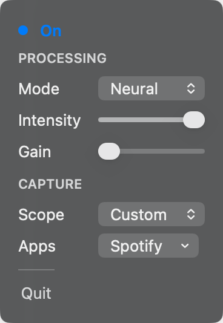

<p align="center">
  
</p>

# MinusOne

**A macOS menu bar app that removes vocals from whatever is playing on your Mac, live.**

Runs quietly in the background. Nothing is ever recorded or saved. It just changes what you hear, in real time.

[](LICENSE)


Turn any song into an instant instrumental for karaoke or practice, right from your menu bar. No editing software, no waiting for a file to process and download.

---

## Preview

<p align="center">
  
</p>

## Table of Contents

- [Preview](#preview)
- [Modes](#modes)
- [Quick Start](#quick-start)
- [Requirements](#requirements)
- [Controls](#controls)
- [Neural model](#neural-model)
- [How audio capture works](#how-audio-capture-works)
- [Development](#development)
- [Limits](#limits)

## Modes

Three modes, trading off speed for quality:

| Mode | Latency | CPU load | How it works | Best for |
|---|---|---|---|---|
| **Direct** | Zero | Negligible | Passthrough, no processing | Verifying capture/routing is set up correctly |
| **Center Cut** | Near-zero (~50 ms ramp on toggle) | Very light | Phase-cancels the mid (L+R) channel, which usually carries the lead vocal | Karaoke, quick on-the-fly removal |
| **Neural** | ~10 s (one processing window) | Light (single-digit % on Apple Silicon) | Runs system audio through Demucs v4 (4-stem) in ~10 s overlapping windows | Cleanest vocal removal, non-real-time-critical listening |

**Neural** buffers audio into overlapping windows before running inference, so playback trails live audio by roughly one window's length. It only starts processing once you turn it on, not on app launch, and re-warms after track changes.

**Center Cut** relies on the vocal being panned dead-center, so it also suppresses other center-panned elements (kick, bass, lead guitar) and does nothing useful on mono sources.

**Direct** passes audio through unmodified. Useful as a baseline to confirm the pipeline is wired up correctly.

Capture uses a system-level audio tap on macOS 14.2+ (supports per-app selection), or [BlackHole](https://existential.audio/blackhole/) as a fallback. See [How audio capture works](#how-audio-capture-works).

## Quick Start

### Download (recommended)

1. Grab the latest `MinusOne-*-macos.zip` from [Releases](https://github.com/cro64/MinusOne/releases)
2. Unzip and move `MinusOne.app` into **Applications**
3. Open it (first launch: right-click → **Open** if macOS blocks it)
4. On the welcome screen, download the Neural model (~200 MB) or skip and use Center Cut

Left-click the waveform icon for settings; right-click any time to toggle vocal reduction.

### Build from source

```bash
Scripts/build-app.sh release          # → build/MinusOne.app
Scripts/download-model.sh             # optional if you skip the welcome download
```

Then open `build/MinusOne.app` (or copy it to Applications).

## Requirements

- macOS 14 or newer (14.2+ recommended)
- [BlackHole 2ch](https://existential.audio/blackhole/), only if Process Tap is unavailable
- Neural: one-time Demucs model download (not bundled)

| Capture | Permission |
|---------|------------|
| Process Tap | System Audio Recording |
| BlackHole | Microphone |

## Controls

| Action | What it does |
|--------|----------------|
| Left-click the icon | Open settings |
| Right-click the icon | Turn vocal reduction on or off |
| Settings → Scope → Custom → Apps | Choose which apps get processed |
| ⌘⌥M | Turn vocal reduction on or off |

### Settings

A compact panel opens next to the icon:

| Setting | What it does |
|---------|----------------|
| **Mode** | Direct · Center Cut · Neural |
| **Intensity** | How much vocal removal to apply (0–100%) |
| **Gain** | Loudness compensation after removal (0–12 dB, default 4.5) |
| **Scope** | All Apps, or **Custom** (picked apps only) |

Intensity and Gain apply to Center Cut and Neural only. Neural is grayed out until the model is installed.

**Custom** only processes checked apps. FaceTime, Discord, and other unchecked apps play normally. Requires Process Tap (macOS 14.2+).

### Status

| What it says | What it means |
|--------------|-----------------|
| **Off** | Vocal reduction is off |
| **On** | Reduction is active |
| **Warming up** | Neural model is loading |
| **Mono input** | Center Cut won't work with this audio |
| **Permission needed** | Open System Settings to grant access |
| **Error** | Tap the info icon for details |

### Icon

The waveform in the menu bar changes with status:

| | State | Meaning |
| :---: | --- | --- |
|  | **Off** | Idle / reduction off (menu-bar tint) |
|  | **On** | Reduction active (accent) |
|  | **Warming up** | Neural model loading |
|  | **Mono input** | Center Cut unavailable |
|  | **Permission needed** | Grant access in System Settings |
|  | **Error** | Something went wrong |

## Neural model

Neural mode uses **Demucs v4** (`htdemucs`), Meta's open-source 4-stem music separation model (vocals, drums, bass, other), converted to CoreML for Apple Silicon.

```bash
Scripts/download-model.sh
```

Downloads [HTDemucs FP16 CoreML](https://huggingface.co/dexxdean/htdemucs-coreml) (~200 MB) to `~/Library/Application Support/MinusOne/Models/`, compiles once (~20 s), and installs `htdemucs.mlmodelc`. The welcome screen can also download it on first launch.

**Kudos:** MinusOne ships with the FP16 CoreML build by [dexxdean](https://huggingface.co/dexxdean/htdemucs-coreml). Original Demucs is by Meta ([facebookresearch/demucs](https://github.com/facebookresearch/demucs)).

## How audio capture works

**Process Tap (macOS 14.2+):** briefly hooks into system audio output, processes it, and restores your previous setup when you quit. Supports All Apps or Custom app lists.

**BlackHole:** routes system audio through a free virtual device, processes it, and restores previous settings on quit. Processes all system audio, no per-app selection.

Either way, nothing is saved or recorded.

## Development

```bash
Scripts/package-icon.sh       # compile Resources/MinusOne.icon → Assets.car (Xcode 26.6+)
Scripts/build-app.sh          # debug build
Scripts/build-app.sh release
swift build --disable-sandbox # SPM only
```

```
Sources/MinusOne/           App and UI
Sources/MinusOne/Audio/     Engine, DSP, neural pipeline
Sources/CAtomics/           Realtime primitives
Resources/MinusOne.icon     App icon (Icon Composer)
Resources/MinusOneIcon.svg  Logo vector (active waveform)
Resources/MinusOneDropDown.png  Settings panel preview
Resources/readme/           Menu-bar icon states for README
Scripts/build-app.sh
Scripts/package-icon.sh
Scripts/download-model.sh
```

Logs: `~/Library/Logs/MinusOne/MinusOne.log`

## Limits

- Direct does not remove vocals; Center Cut needs stereo audio and won't work on mono sources.
- Center Cut can also mute other centered instruments, not just vocals. Neural avoids that pattern but isn't perfect either.
- Neural adds ~10 s delay and re-warms after track changes (dry audio until ready).
- BlackHole processes all system audio. Custom app selection requires Process Tap.
